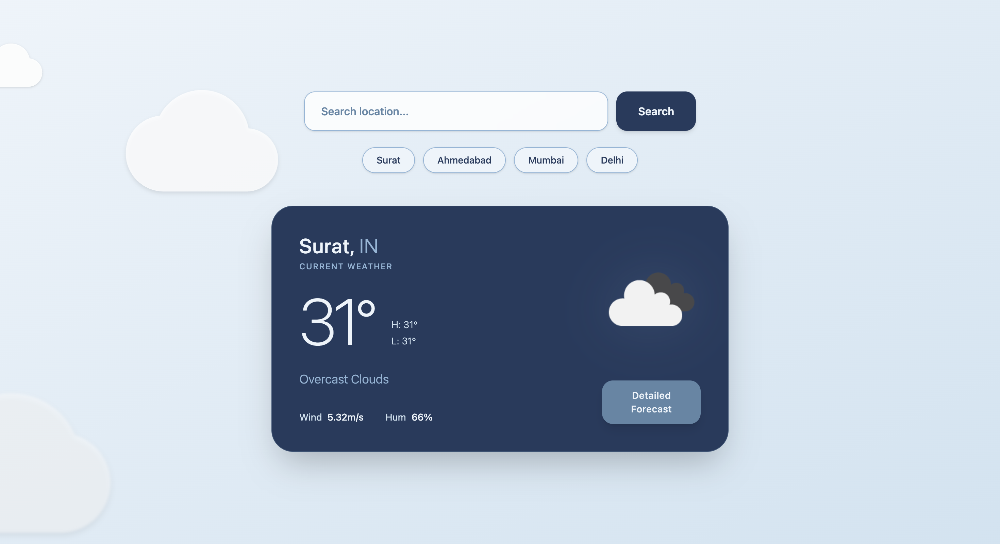
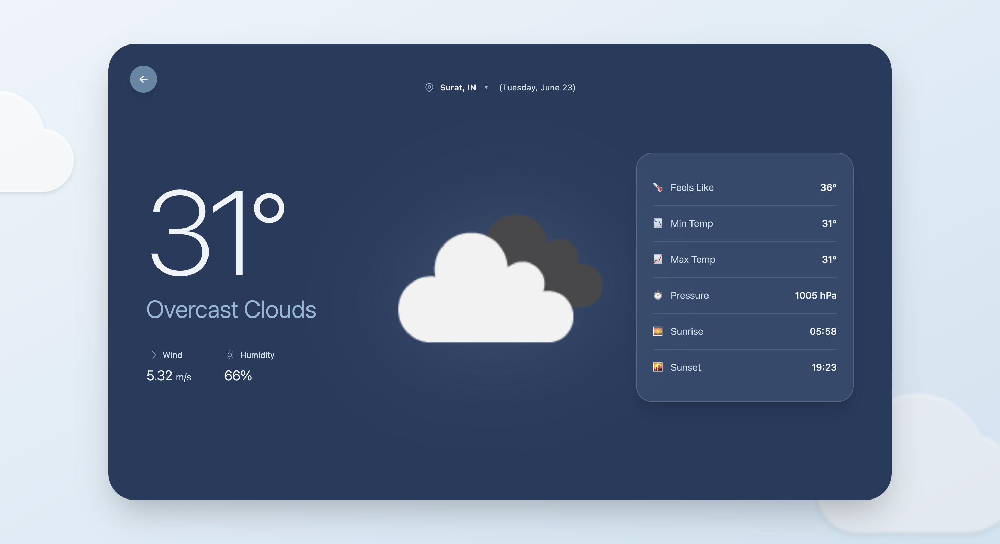

# ⛅ React Weather Dashboard Application

A responsive and interactive React application that fetches and displays real-time weather information using the OpenWeather API. Users can search for specific cities and view detailed meteorological data.

## 📸 Screenshots

*Figure 1: Weather Dashboard & Search Functionality*

*Figure 2: Detailed Weather Information Route*

## 🚀 Objective
Create a React Weather Dashboard Application that fetches and displays weather information. Users can easily search for cities and view detailed weather metrics.

## ✨ Features

### 1. Weather Dashboard Page
Displays weather information in clean, readable cards. Each card includes:
- 🌤️ Weather Icon
- 🏙️ City Name & Country
- 🌡️ Temperature
- ☁️ Weather Condition
- 💧 Humidity
- 💨 Wind Speed

### 2. Search Functionality
A built-in search box to fetch weather data dynamically based on user input. 
*Examples to try: Surat, Ahmedabad, Mumbai, Delhi.*

### 3. Detailed Weather Page
Utilizes **React Router** to navigate to a dedicated detail page.
- **Route:** `/weather/:city`
- **Displays:**
  - City Name & Country
  - Current Temperature, Minimum & Maximum Temperature
  - Feels Like Temperature
  - Humidity & Pressure
  - Wind Speed
  - Sunrise & Sunset Times

### 4. UI/UX Handlers
- **Loading State:** Displays `Loading...` while the API fetches data.
- **Error Handling:** Gracefully handles failed API calls or invalid cities by displaying `Failed to fetch data`.

## 🛠️ Tech Stack
- **Frontend:** React.js, React Router
- **API:** [OpenWeatherMap API](https://openweathermap.org/)

## ⚙️ Getting Started

### Prerequisites
- Node.js installed
- OpenWeather API Key
